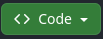
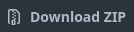
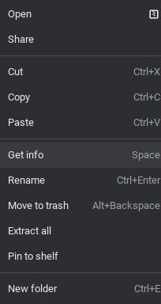
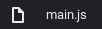

# J8D Docs

Welcome to the J8D Docs. This will help you on your journey of learning my JavaScript library. Please continue to the next section.

# About J8D

J8D is a JavaScript/TypeScript library meant to help others make 8-bit styled games. In these documents, we will be going through the basics and advanced functions of J8D.

## Prerequisites

Here is what you will need on your journey:
* Past JavaScript/HTML expierience; CSS optional
* Basic knowledge on programming terminology
* Terminal usage knowledge -Optional-

If you are ready, let's continue!

# Section I - Setting Up J8D

To install J8D, please follow the directions below:

Click the `Code` button on the repo.<br>
<br>
Next, click the `Download ZIP` button under the `local` tab.<br>
<br>
Unzip the `J8D-github.io-main.zip` file in your file explorer.<br>
<br>
Now, open the `main.js` file in your newley created folder.<br>
<br><br>

J8D is now installed and ready to be used. Let's move on to the next section.

# Section II - Syntax
## Basic Syntax
All J8D variables and functions begin with the `j8` prefix. This is used to give immediate access to all functions and variables so required research is at a minimum.
### Functions
All function parameters in J8D have semi-strict types. Inputs like objects or lists are usually put in the `any` type.

That is really all you need to know about J8D syntax. It's pretty simple. Let's move on.

# Section III - Writing Our First Program

Let's get to writing our programs! You should have your `main.js` file opened in a code or text editor of your choice.

We start off with this code in the demo:
``` javascript
const canvas = document.getElementById("mainWindow");
const ctx = canvas.getContext('2d');

j8_mainWindow=ctx;

let y = 50
let x = 50

function loop() {
    j8_clearRect(0,0,256,240);
    j8_setBGColor("lightskyblue");
    j8_lineWidth=2;
    j8_ofRect(x,y,10,10,"maroon","red");

    if(j8_keys.ArrowUp){
        y-=1;
    }
    if(j8_keys.ArrowDown){
        y+=1;
    }
    if(j8_keys.ArrowLeft){
        x-=1;
    }
    if(j8_keys.ArrowRight){
        x+=1;
    }
}

j8_setLoopFunction(loop,10);
```

Delete everything except for the first 4 lines of code. You should end up with this.

``` javascript
const canvas = document.getElementById("mainWindow");
const ctx = canvas.getContext('2d');

j8_mainWindow=ctx;
```

Lets's walk through this code.

Firstly, the `const canvas` statement. This sets our canvas variable to the canvas id "mainWindow" from our `index.html` file.
``` javascript
const canvas = document.getElementById("mainWindow");
```
The `const ctx` statement sets up a variable used as the surface to draw on. It uses `canvas.getContext('2d');` to set its value, '2d' being the type of canvas context.
``` javascript
const ctx = canvas.getContext('2d');
Lastly, we have `j8_mainWindow=ctx;`. This sets the main window of the J8D library to our `ctx` variable so the library knows what surface to draw on.
